# Project Silate — 3D Human Motion Translation Prototype

**Project Silate** is an interactive 3D humanoid motion translation system built with **TypeScript**, **Three.js**, and **Vite**. It converts natural language phrases into semantic, multi-channel humanoid motion sequences in real time with smooth transition blending, layered idle animation, and a comprehensive debug suite.

This web prototype serves as the architectural foundation and reference implementation for the upcoming native Android implementation using **SceneView** and **Google Filament**.

---

## Architecture Pipeline

```mermaid
graph LR
    subgraph Input ["1. Input & Parsing"]
        Text["Natural Language<br/><i>'hello how are you'</i>"] --> Tokenizer["PhraseTokenizer<br/><i>lowercase, strip punct</i>"]
        Tokenizer --> Tokens["Tokens Array<br/><i>['hello', 'how', ...]</i>"]
    end

    subgraph Data ["2. Data Resolution"]
        Tokens --> Repo["MotionRepository<br/><i>File / API / Memory Cache</i>"]
        Repo --> Resolver["MotionResolver<br/><i>channels, gestures, rotations</i>"]
    end

    subgraph Sequencing ["3. Composition & Execution"]
        Resolver --> Composer["MotionComposer<br/><i>transitions (~180ms), blending</i>"]
        Composer --> Executor["MotionExecutor<br/><i>frame-driven, interruption, pause/stop</i>"]
    end

    subgraph AvatarDrive ["4. 3D Avatar Control"]
        Executor --> Channels["9 Parallel Channels<br/><i>body, arms, hands, fingers, head, face</i>"]
        Channels --> AC["AvatarController<br/><i>Quaternion SLERP, idle overlay</i>"]
        AC --> SC["SkeletonController<br/><i>Mixamo normalization, rest poses</i>"]
        SC --> WebGL["Three.js WebGL Scene<br/><i>Bones, Mesh, SkeletonHelper</i>"]
    end
```



---

## Features

- **Text-to-Motion Pipeline:** Tokenizes phrases, resolves motion definitions, and chains multiple words into fluid continuous performances.
- **9 Independent Body Channels:** Concurrent control over `body`, `head`, `leftArm`, `rightArm`, `leftHand`, `rightHand`, `fingers`, `face` (logged), and `lips` (logged).
- **Smooth Transition Blending:** The `MotionComposer` and `AnimationBlender` synthesize ~180ms dynamic transitions between arbitrary motions using Quaternion SLERP.
- **Immediate Interruption Handling:** Translating mid-sequence immediately stops the previous sequence, blends to neutral in 150ms, and starts the new motion with no queue lag.
- **Hand & Finger Poses:** Named configurations (`open`, `closed`, `point`, `thumb_up`, `peace`) rotating finger bones cleanly.
- **Layered Idle Animation:** Keyframe idle mixer runs underneath; procedural gestures layer on top via frame delta interpolation. An interactive switch allows toggling the idle state on/off.
- **Skeleton Visualization:** Toggleable Three.js `SkeletonHelper` overlay in the debug panel.
- **Playback Controls:** Pause, resume, and stop buttons directly in the user interface.
- **Storage-Agnostic Abstraction:** Clean `MotionRepository` interface with both `FileMotionRepository` and `ApiMotionRepository` (`GET /api/motions/:word`).
- **Comprehensive Debug Inspector:** Live model stats, bone hierarchy tree, animation clips, active channel states, speed slider (0.1× – 3.0×), and real-time event logs.

---

## Project Structure

```
proto/
├── assets/
│   ├── model/
│   │   └── humanoid.glb           # Mixamo humanoid GLB model
│   └── motion/                    # 10 authored motion JSON files
│       ├── hello.json
│       ├── how.json
│       ├── are.json
│       ├── you.json
│       ├── thank.json
│       ├── yes.json
│       ├── no.json
│       ├── please.json
│       ├── goodbye.json
│       └── welcome.json
├── src/
│   ├── avatar/
│   │   ├── Avatar.ts              # GLTF loading, mixer, skeleton helper
│   │   ├── AvatarController.ts    # 9-channel frame-driven bone transform engine
│   │   ├── FacialController.ts    # Morph target stub & logger
│   │   └── SkeletonController.ts  # Bone normalization & hand poses
│   ├── motion/
│   │   ├── AnimationBlender.ts    # Quaternion SLERP & easing functions
│   │   ├── GestureLibrary.ts      # Procedural gestures (wave, nod, etc.)
│   │   ├── MotionComposer.ts      # Multi-word chaining & transition synthesis
│   │   ├── MotionDefinition.ts    # TypeScript interfaces & channel types
│   │   ├── MotionExecutor.ts      # Frame-driven step runner & playback controls
│   │   ├── MotionRepository.ts    # File & API repository implementations
│   │   └── MotionResolver.ts      # Converts JSON definitions into executable steps
│   ├── scene/
│   │   ├── Camera.ts              # PerspectiveCamera setup
│   │   ├── Lighting.ts            # Ambient + Directional lights + shadows
│   │   ├── Renderer.ts            # WebGLRenderer with tone mapping
│   │   └── SceneManager.ts        # Render loop & OrbitControls
│   ├── state/
│   │   └── AppState.ts            # Reactive application state manager
│   ├── translation/
│   │   └── PhraseTokenizer.ts     # Input string normalization & tokenization
│   ├── ui/
│   │   ├── DebugPanel.ts          # Collapsible inspector & live telemetry
│   │   └── UI.ts                  # Control bar, playback buttons & toast alerts
│   ├── main.ts                    # Bootstrap & dependency wiring
│   └── style.css                  # Modern dark theme styles
├── MOTION_SCHEMA.md               # Motion authoring schema documentation
├── index.html                     # HTML5 UI shell
├── vite.config.ts                 # Vite bundler & asset middleware
├── package.json
└── tsconfig.json
```

---

## Getting Started

### Prerequisites

- Node.js (v18 or higher recommended)
- npm or yarn

### Installation & Run

1. Navigate to the `proto/` directory:
   ```bash
   cd Project-Silate/proto
   ```
2. Install dependencies:
   ```bash
   npm install
   ```
3. Start the local Vite development server:
   ```bash
   npm run dev
   ```
4. Open your browser at `http://localhost:5173`.

### Avatar Model Setup

Ensure your Mixamo humanoid model is placed at:
```
proto/assets/model/humanoid.glb
```
If the file is missing upon startup, a friendly viewport overlay will prompt you to place it and click **Retry Loading**.

---

## How to Author New Motions

To add new words to the motion library:
1. Create a new JSON file in `proto/assets/motion/{word}.json`.
2. Define the motion using the multi-channel schema or sequential timeline.
3. Reference `MOTION_SCHEMA.md` for complete schema details, supported hand poses, easing equations, and real examples.

---

## Swapping Avatar Models

Project Silate is designed to work with any standard Mixamo humanoid rig:
- **Bone Naming:** `SkeletonController` automatically maps both `mixamorig{Bone}` and `{Bone}` variants (e.g. `mixamorigRightArm` → `RightArm`).
- **Rest Poses:** Rest rotations are captured on model load; procedural overlays return to these exact rest rotations.
- **Morph Targets:** If the model contains facial shape keys / blendshapes, `Avatar.ts` indexes them automatically in the debug panel.

---

## Android Implementation Guide (SceneView / Filament)

This web prototype was deliberately architected to map 1:1 to modern Android 3D development patterns:

| Web Prototype (Three.js / TS) | Android Target (SceneView / Filament / Kotlin) |
| :--- | :--- |
| `Avatar.ts` / `GLTFLoader` | SceneView `ModelNode` / Filament GLTF asset loader |
| `SkeletonController.ts` | `ModelNode.setBoneTransform()` / Filament entity hierarchy |
| `AvatarController.ts` | Kotlin Coroutine / Choreographer frame listener (`Choreographer.postFrameCallback`) |
| `MotionRepository.ts` | Room SQLite DB / Retrofit API repository (`MotionRepository` interface) |
| `MotionComposer.ts` | Kotlin Motion Sequencer module |
| `AnimationBlender.ts` | `androidx.compose.animation` easing or custom Quaternion SLERP |
| `AppState.ts` | `StateFlow<AppState>` / `SharedFlow` |
| UI Overlay & Debug Panel | Jetpack Compose UI overlay with Material3 components |

### Key Android Porting Takeaways:
1. **Never use `Timer` or `delay()` for bone transformations:** Use the Choreographer frame delta in the render loop to drive Quaternion SLERP.
2. **Channel Separation:** Keep arms, head, and fingers independent in Kotlin data classes to allow parallel gesture execution.
3. **Repository Pattern:** Keep `MotionRepository` strictly decoupled from Filament/SceneView rendering logic so motion files can be bundled in Android `assets/`, cached in Room, or fetched via Retrofit.
